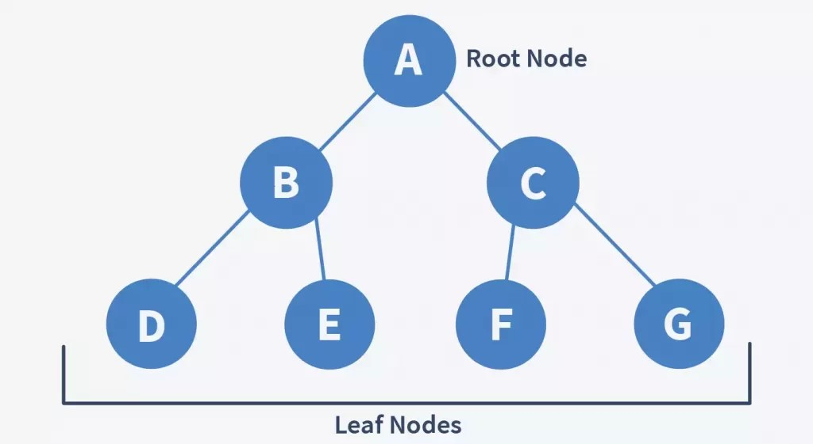
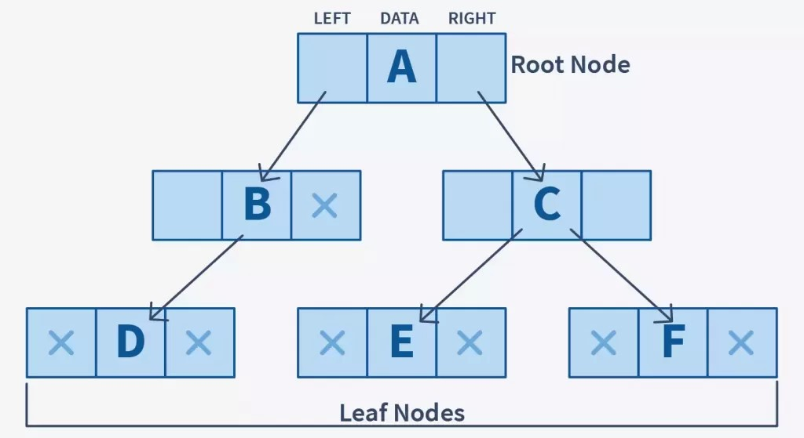
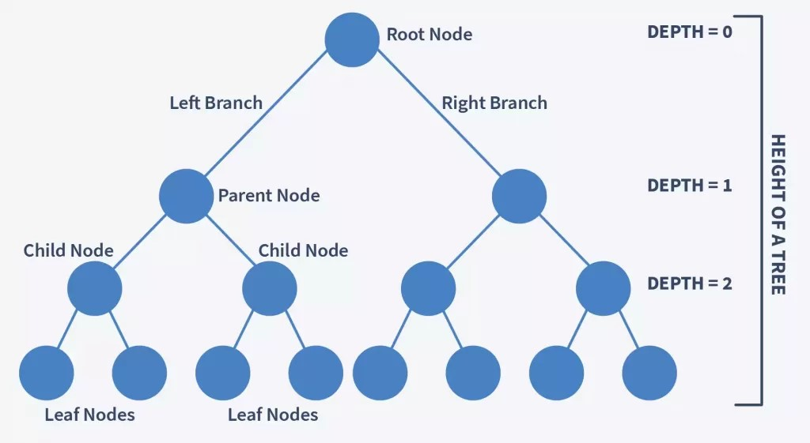
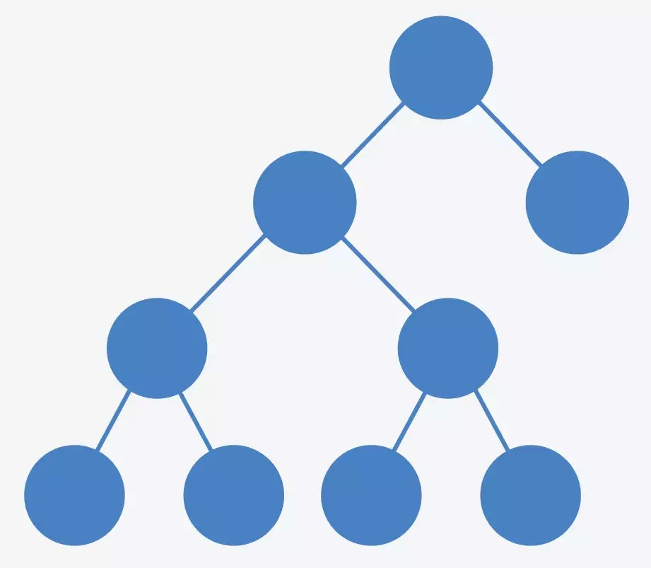
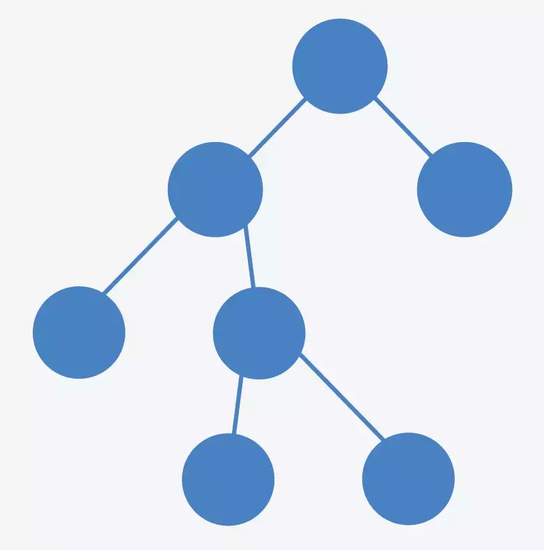
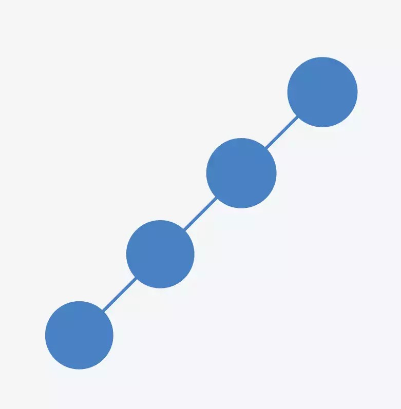

# Introduction to binary tree

A binary tree is a tree-type non-linear data structure with a maximum of two children for each parent. Every node in a binary tree has a left and right reference along with the data element. The node at the top of the hierarchy of a tree is called the root node.

## Complexity of Binary Tree

- **Time complexity:-** *O*(*n*)
- **Space complexity:-** *O*(*n*)

|  |  |
|---------------------------|----------------------------|

## Terminologies in Binary Tree in Data Structure

**1. Nodes** – Nodes are the building blocks of any data structure. They majorly contain some data and link to the next/previous nodes. In the case of binary trees, they contain the address of the left and the right child respectively.

**2. Root** – The topmost node in a tree is known as the root node. A tree can have at most one root node.

**3. Parent Node** – A node (except the root) that has a succeeding node is known as a parent node.

**4. Child Node** – A node that has a preceding node is known as a child node. A node can be both parent and child depending on the node that is in context.

**5. Leaf Node** – A node with no children.

**6. Internal Node** – A node that has at least one child node is known as an internal node.

**7. Depth of a Binary Tree** – The number of edges from a node in the tree to the root node.

**8. Height of a Binary Tree** – The number of edges from the deepest node in the tree to the root node.

 

## Types of Binary Tree in Data Structure

There are several types of binary trees in data structure, including:

- **Full binary tree:** A binary tree is called a full binary tree if every node has 0 or 2 children. In other words, if a node has a child, then it must have two children.
- **Complete binary tree:** A binary tree is called a complete binary tree if all levels are completely filled, except possibly the last level, and the last level has all keys as left as possible.
- **Perfect binary tree:** A binary tree is called a perfect binary tree if all internal nodes have two children and all leaves are at the same level.
- **Balanced binary tree:** A binary tree is called a balanced binary tree if the height of the tree is O(Log n) where n is the number of nodes.
- **Degenerate (or pathological) tree:** A binary tree is called a degenerate tree if each parent node has only one associated child node.

**Let’s discuss some of them in detail** –

### 1. Full Binary Tree

A full binary tree, also known as a proper binary tree, is a tree in which each internal node has either zero or two children nodes is known as a full binary tree.

In other words, if in a binary tree a node contains only one child node, it is not a full binary tree.

The following diagrams shows a full binary tree –

| | |
|--|--|

**Notice how each node has either zero or two children nodes.**

In a full binary tree, if there are n number of total nodes –

- The number of internal nodes is given by (n-1)/2
- The number of leaf nodes is given by (n+1)/2

### 2. Complete Binary Tree

A complete binary tree is a binary tree in which all the elements are arranged without missing any sequence.

In a complete binary tree –

- All the levels are completely filled except the last level that may or may not be completely filled.
- Elements are filled from left to right.

The following trees are complete binary trees since they have no empty spaces in them.

### 3. Perfect Binary Trees

If in a tree all the internal nodes have exactly two children nodes, it is known as a perfect binary tree.

In a perfect binary tree, all the leaf nodes are on the same level.

The following diagrams represents a perfect binary tree –

Consider a perfect binary tree with height h, the total number of nodes in this case is given by 2h – 1.

### 4. Degenerate Binary Trees

If in a binary tree each node contains only one child node either on the left side or the right side of the tree, it is known as a degenerate binary tree.

Degenerate binary trees are equal to linked lists in terms of performance. The following tree shows a degenerate binary tree –

Degenerate binary trees can also be classified into two types –

**a. Left-skewed** – A degenerate binary tree in which all the nodes lean towards the left side of the tree. The following diagram shows a left-skewed degenerate binary tree –

**b. Right-skewed** – A degenerate binary tree in which all the nodes lean towards the right side of the tree. The following diagram shows a right-skewed degenerate binary tree –

### 5. Balanced Binary Trees

A binary tree is said to be balanced if the height of the left and the right subtrees differ by 0 or 1.

In a balanced binary tree, both the left and right trees are also balanced. The following diagram shows a balanced binary tree –

Notice that in the first image, the right subtree is at the height of 3, and the left subtree is at 2. The difference between the heights of the left and the right subtree is therefore 1. Therefore, the given tree is a balanced binary tree.

### Binary tree Time Complexity

Searching: Worst case complexity of O(n). Insertion: Worst case complexity of O(n). Deletion: Worst case complexity of O(n).

### Binary tree Space Complexity

Searching: O(n). Insertion: O(n). Deletion: O(n).
